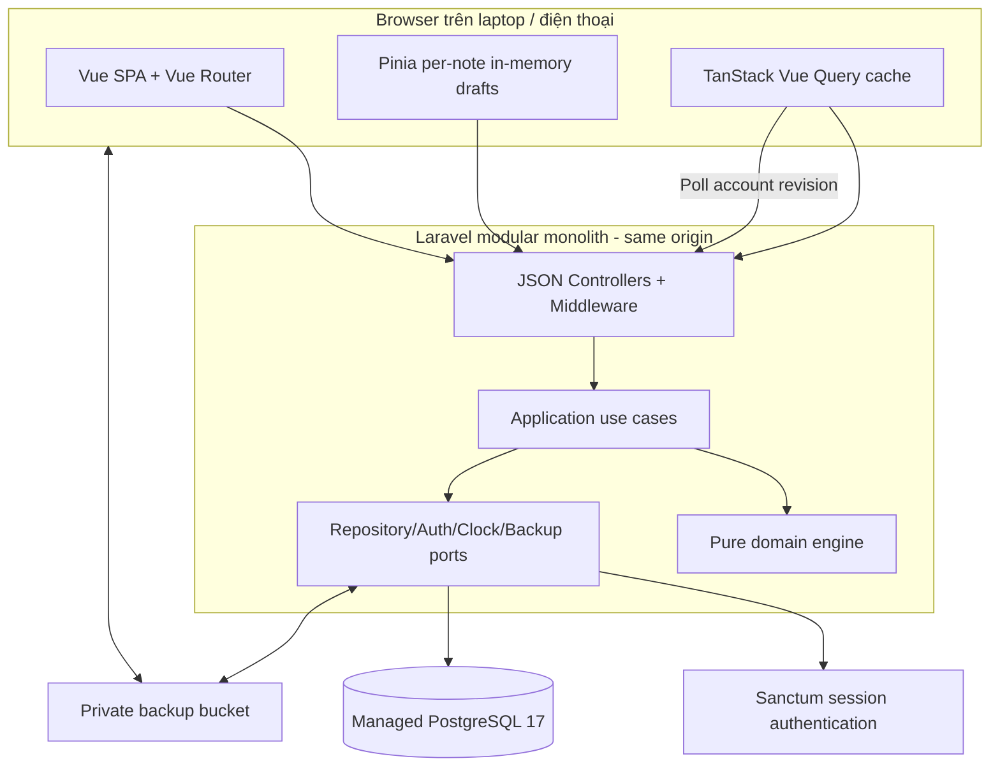
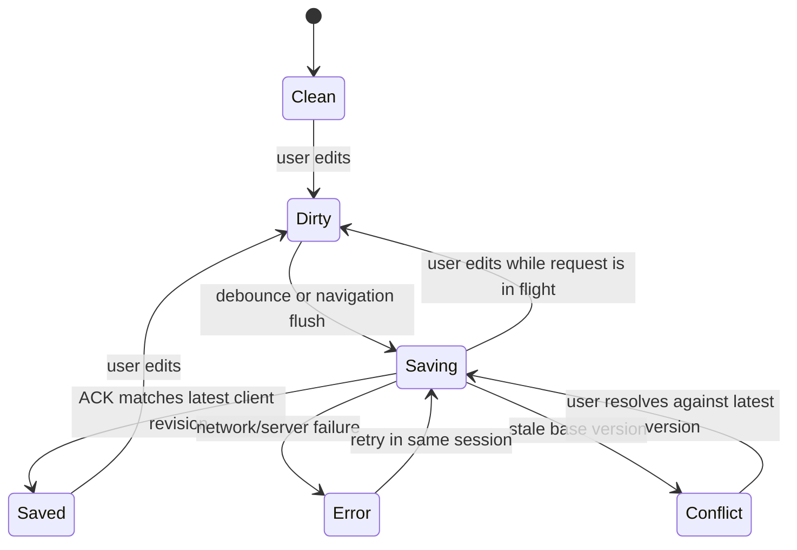

# NoteFlow — Architectural Proposal cho MVP v1

- **Trạng thái:** Hướng Vue + Laravel đã được Product Owner duyệt; các quyết định sản phẩm D-01–D-10 còn mở nếu chưa có xác nhận riêng.
- **Ngày:** 2026-09-12.
- **Cập nhật:** 2026-09-13; chuyển baseline sang Vue SPA + Laravel API theo review của Product Owner.
- **Nguồn ràng buộc:** [PRD v1.1](../../product/prd.md), [Project Brief v1.3](../../product/project-brief.md), [UX Specification v1.0](../../ux/ux-spec.md).
- **Nguyên tắc ưu tiên:** Khi tài liệu khác nhau, PRD là baseline áp dụng.
- **Phạm vi lần này:** Đề xuất kiến trúc; chưa viết application code, migration hay chia implementation story.

## Khuyến nghị tổng thể

Xây NoteFlow dưới dạng **modular monolith theo ports-and-adapters**: Vue 3 + TypeScript + Vite cho SPA, Laravel/PHP cho JSON API, cùng repository và cùng origin khi deploy. PostgreSQL managed là nguồn dữ liệu duy nhất; Laravel Sanctum dùng session cookie; polling account revision phục vụ đồng bộ MVP; private S3-compatible Storage chuyển file backup. Hướng stack này đã được Product Owner duyệt.

Điểm thiết kế trung tâm không phải là số lượng màn hình mà là ba invariants:

1. Ngày, tuần, goal period và streak do server tính theo một timezone tài khoản cố định.
2. Mọi mutation có version, idempotency identity và dataset epoch để không mất dữ liệu khi hai thiết bị cùng sửa.
3. Backup import thay toàn bộ phải là một operation bền, có write fence và một transaction all-or-nothing.

Đề xuất này không đưa vào MVP bất kỳ feature nào thuộc Future Scope hoặc Out of Scope. `owner_id`, revision polling và private Storage là cơ chế kỹ thuật để bảo vệ/đồng bộ dữ liệu và chuyển file backup; chúng không mở public signup, collaboration, offline mode hay attachment cho note.

---

## 1. Architectural requirements

| ID | Architectural requirement | Hệ quả bắt buộc | Nguồn chính |
| --- | --- | --- | --- |
| AR-01 | Giữ đúng scope MVP và thứ tự Challenge → Notes → Calendar | Một deployable unit; module hóa theo domain; không microservice, AI/search service, queue hay analytics platform | PRD §8–9; RISK-001 |
| AR-02 | Dữ liệu cá nhân chỉ hiện/sửa sau xác thực | Kiểm tra auth và owner ở server cho mọi route/resource; chặn public signup; backup cũng qua cùng boundary | FR-001; NFR-007; AC-001 |
| AR-03 | Hai thiết bị dùng cùng ngày/tuần | Server-authoritative account clock, IANA timezone cố định, tuần thứ Hai–Chủ nhật; không lấy timezone thiết bị làm quyết định | FR-006; AC-005 |
| AR-04 | “Đã lưu” phải đúng sự thật và bền | Chỉ server acknowledgement của đúng phiên bản mới đánh dấu saved; dữ liệu saved sống qua reload và thiết bị khác | FR-002–005; NFR-004–006 |
| AR-05 | Mutation đồng thời không đếm trùng hoặc ghi đè âm thầm | UUID/idempotency key, row version, dataset epoch và typed conflict; Done là desired state, không dùng toggle | FR-009, FR-043; AC-039–041 |
| AR-06 | Challenge history/streak đúng sau backfill, undo, target change và archive | Persist facts + goal timeline; một pure domain engine tạo mọi projection; derived values không là nguồn sự thật độc lập | FR-007–023, FR-042; NFR-003, NFR-010 |
| AR-07 | Chuyển note không mất draft hoặc gắn ACK nhầm | Draft state machine riêng theo note ID trong memory của phiên; request/response có client revision | FR-003–005, FR-029; AX-02–04 |
| AR-08 | Search saved notes nhanh, không dấu | Database-native full-text search trên title/body saved; canonical Vietnamese normalization; GIN index; không tìm journal/event | FR-030; NFR-009; AC-026 |
| AR-09 | Event qua ngày và Today/Calendar nhất quán | Event lưu bằng UTC instants; ngày query chuyển từ account-local interval; Done và event độc lập | FR-031–038; AC-027–030 |
| AR-10 | Restore không thể để lại dataset một phần | Validate trước confirm; write fence toàn account; transaction replace-all; durable operation status; data epoch mới sau success | FR-040–046; NFR-008; AC-042–045 |
| AR-11 | App usable trên laptop/phone, touch và keyboard | Route-level loading, responsive shell không remount draft store, accessible focus/dialog/list behavior | NFR-001–002; UX §12–14 |
| AR-12 | MVP vận hành nhỏ và đo được | Single region, managed services, separate staging/production, structured logs không chứa nội dung riêng tư, benchmark bằng fixture đã duyệt | NFR-006, NFR-009; DEP-005–009 |

Không có yêu cầu uptime, tải nhiều người dùng, multi-region, dung lượng vô hạn hay SLA đồng bộ. Kiến trúc không tự tạo các cam kết đó.

---

## 2. Technology stack đề xuất

| Lớp | Technology | Phiên bản đề xuất | Lý do chọn cho NoteFlow |
| --- | --- | --- | --- |
| Backend runtime/framework | PHP + Laravel | PHP 8.4 / Laravel 13.x | Laravel 13 hỗ trợ PHP 8.3–8.5; backend có routing, validation, transaction và testing thống nhất |
| Frontend/build | Vue 3 + TypeScript + Vite | Vue 3 / TypeScript 6 / Vite 8; Node 24 LTS ≥ 24.12 cho build | SPA tương tác cao; build ra static assets; Node chỉ cần cho development/CI |
| Routing/draft state | Vue Router + Pinia | Router 5 / Pinia 4; patch tương thích khóa lúc scaffold | Deep links và per-note draft store sống qua route navigation |
| Styling | Tailwind CSS | 4.x | Responsive/focus states theo UX, không thêm design-system platform |
| Server state | TanStack Vue Query | 5.x | Cache, cancellation, mutation state, invalidate/refetch khi account revision đổi |
| Validation/contracts | OpenAPI + Laravel Form Requests/DTOs | Contract versioned trong repository | OpenAPI là canonical HTTP contract; sinh TypeScript types, kiểm thử validation PHP và response theo schema |
| SQL access/migrations | Eloquent + Laravel migrations | Theo Laravel 13 | Repositories dùng transaction rõ; SQL riêng cho FTS, constraints và locking khi cần |
| Database | Managed PostgreSQL | PostgreSQL 17, minor còn hỗ trợ do provider quản lý | Quan hệ/constraint/transaction cho challenge history và atomic restore; `unaccent`, FTS và GIN |
| Identity | Laravel Sanctum | Bản stable tương thích Laravel 13 | First-party SPA session cookie; đúng một account provision thủ công, không public registration |
| Cross-device signal | Account revision polling | Visible-tab interval khởi điểm 5 giây | Kiểm tra revision/epoch rồi refetch; không cần WebSocket/Reverb cho baseline MVP |
| Backup transfer | Laravel Filesystem + private S3-compatible bucket | Provider/SDK tương thích được xác nhận khi deploy | Presigned upload/download ngắn hạn; file backup không đi qua app proxy |
| Backend tests | Pest trên PHPUnit | Pest 5 / PHPUnit 13; khóa Composer compatibility lúc scaffold | Pure PHP domain tests, HTTP/API, PostgreSQL integration và concurrency |
| Frontend tests | Vitest + Vue Test Utils | Bản stable tương thích Vite/Vue | Draft state machine, component behavior và cache reconciliation |
| Browser tests | Playwright | Stable, khóa cùng lockfile | Multi-context, interruption và device/browser matrix |
| Hosting/CI | Nginx + PHP-FPM, managed PostgreSQL; GitHub Actions | Provider/budget còn mở ở D-04 | Cùng origin phục vụ Vue assets và Laravel API; một release của repository |

Đây là baseline phiên bản đề xuất, chưa phải lockfile đã chạy thử. Khi được giao scaffold, khóa PHP/Composer và frontend lockfiles tương thích rồi chạy build/typecheck/integration; không suy rằng các release riêng lẻ đã chứng minh toàn stack tương thích. PHP domain engine là nơi duy nhất quyết định ngày/tuần/streak; frontend chỉ định dạng server DTO. Hai ngôn ngữ không chia sẻ trực tiếp runtime schema: OpenAPI và contract tests chặn drift giữa TypeScript và PHP.

Lựa chọn này cố ý dùng PostgreSQL thay vì document database: NoteFlow có uniqueness theo challenge/date, note thuộc đúng một notebook, target history theo thời gian, event interval và restore transaction. Các constraint quan hệ giúp chặn trạng thái sai ngay tại storage boundary.

Không cần Elasticsearch/Meilisearch cho khoảng 1.000 note ngắn. Không cần Redis vì PRD không có tải/latency yêu cầu khiến cache phân tán trở thành cần thiết.

---

## 3. System architecture đề xuất

### Module boundaries

| Module | Owns | Không được làm |
| --- | --- | --- |
| `identity` | Verified owner, account timezone, account revision/data epoch, restore write fence | Không chứa UI preferences hay product domain facts khác |
| `challenges` | Challenge, goal timeline, daily record, journal, progress/streak engine, archive rules | Không ghi Calendar event hoặc tạo Note |
| `notes` | Notebook, default notebook, note, move/delete, search index/query | Không tìm challenge journal hoặc event |
| `calendar` | Timed event, month/day overlap queries | Không tự thay đổi Done |
| `today` | Compose read model từ challenge + calendar; cung cấp default-notebook entry point | Không sở hữu bản sao challenge/event |
| `backup` | Snapshot schema, export, validate, import operation, write fence orchestration | Không đặt ra data model thứ hai hoặc merge backup |
| `client-drafts` | Draft/title/body state theo note trong tab hiện tại | Không trở thành local database/offline queue |

`Today` là query composition, không có bảng `today`. Calendar icon là projection từ `challenge_daily_records`, không có bảng sao chép Done. Điều này loại bỏ hai nguồn dữ liệu dễ lệch.

### Dependency rule

`Vue UI → JSON API → Application → Domain`. Infrastructure adapters implement ports hướng vào Application; pure PHP Domain không phụ thuộc Laravel controllers/facades, Eloquent, browser API hoặc system clock. Vue SPA và Laravel nằm trong cùng repository; Nginx phục vụ static assets và `/api/v1` cùng origin, không cần SSR/Nuxt/Inertia cho MVP.

Mọi clock-dependent test truyền `AccountClock` giả. Mọi mutation gọi owning module; backup là ngoại lệ orchestration đã khai báo và chỉ thao tác qua snapshot contracts/transaction boundary.

Repository/schema của module là private. Cross-module reads dùng typed query ports có đơn vị, `isDone`, ngày và version rõ ràng; Today/Calendar đọc cùng snapshot và một `AccountTimeContext` được chụp một lần cho mỗi use case. PHP Domain dùng `DateTimeImmutable`/`DateTimeZone` qua injected clock, không gọi system clock rải rác. UI nhập và hiển thị giờ theo timezone tài khoản; server chuyển event wall-time sang UTC, không dùng timezone thiết bị. Nếu chọn timezone có DST, thời điểm local mơ hồ/không tồn tại phải bị từ chối để sửa trước khi lưu.

---

## 4. Database architecture đề xuất

### Core schema

| Table | Dữ liệu chính | Constraint/index quan trọng |
| --- | --- | --- |
| `users`, `sessions` | Owner identity/password hash và server-side session | Laravel auth tables; ngoài product backup; admission giới hạn owner đã provision |
| `account_state` | `owner_id`, `timezone`, `account_revision`, `data_epoch`, `write_state` | PK/FK tới Laravel user; timezone IANA; một row/account |
| `notebooks` | `id`, `owner_id`, `name`, `is_default`, `row_version`, timestamps | Một default notebook/account; default không xóa; owner + updated index |
| `notes` | `id`, `owner_id`, `notebook_id`, nullable/blank title, body text, `search_document`, `content_version`, `membership_version`, `row_version`, timestamps | FK notebook `ON DELETE RESTRICT`; owner/notebook/updated index; GIN search index; logical versions match conflict matrix |
| `challenges` | `id`, `owner_id`, name, description, `start_date`, `archived_on`, `row_version` | `archived_on >= start_date`; archived item không reopen qua API |
| `challenge_target_periods` | `owner_id`, `challenge_id`, `target_days`, `effective_from`, created timestamp | `target_days BETWEEN 1 AND 7`; unique `(challenge_id, effective_from)` |
| `challenge_daily_records` | `owner_id`, `challenge_id`, `local_date`, `is_done`, journal, `completion_version`, `journal_version`, `row_version`, timestamps | PK `(challenge_id, local_date)`; Done/journal có token độc lập; row vẫn tồn tại khi undo |
| `calendar_events` | `id`, `owner_id`, name, `starts_at`, `ends_at`, description, `row_version` | `ends_at > starts_at`; overlap indexes theo owner/time |
| `backup_import_operations` | operation ID, owner, object key/hash, schema version, status, epochs, timestamps, safe error code | Unique idempotency identity; durable `pending/succeeded/failed` result |
| `mutation_commands` | owner, epoch, command ID/type, request hash, resource ID, acknowledgement/version | Unique `(owner_id, data_epoch, command_id)`; lưu atomically với mutation để replay không ghi lần hai |

Tất cả product rows có `owner_id` dù MVP chỉ có một account. Đây là authorization boundary, không phải public multi-user feature.

### Source of truth và derived data

Các facts được backup và restore:

- account timezone;
- notebooks và notes;
- challenges, start/archive dates;
- toàn bộ target periods, gồm future pending target nếu challenge còn active;
- daily records, `is_done` và journal;
- calendar events.

Không coi `weekly_progress`, `current_streak`, `longest_streak`, `archived_streak` hoặc calendar icons là facts độc lập. Domain engine tính lại chúng từ target periods + daily records + account clock. Với quy mô MVP, tính toàn lịch sử một challenge khi history bị sửa là đơn giản và an toàn hơn incremental cache. Chỉ thêm cache nếu profiling chứng minh cần; cache phải xóa/rebuild được.

### Temporal conventions

- Challenge `start_date`, `archived_on`, target `effective_from` và daily `local_date` dùng PostgreSQL `date` theo account timezone.
- Event/audit timestamps dùng `timestamptz` và lưu UTC.
- Query event cho một ngày tạo `[dayStart, nextDayStart)` trong account timezone rồi lấy event có `starts_at < dayEnd AND ends_at > dayStart`.
- Target hiệu lực của một ngày là row có `effective_from` lớn nhất nhưng không sau ngày đó. Row duy nhất sau account-today là pending target; replace/cancel diễn ra trong transaction.
- Archive transaction xóa target period chưa có hiệu lực, giữ các period đã hiệu lực và facts lịch sử.

### Concurrency and isolation

- Mỗi mutable aggregate có `row_version` tăng đúng một lần khi state thực sự đổi.
- Mọi write khóa cùng row `account_state FOR UPDATE`, rồi kiểm tra owner, version của component, `data_epoch` và `write_state`; giữ lock đến commit. Việc tuần tự hóa ghi là trade-off có chủ ý cho một account.
- Client-generated UUID làm create retry idempotent; daily record có natural uniqueness `(challenge_id, local_date)`.
- Với Done/undo: nếu desired state đã bằng state saved hiện tại, trả success idempotent; nếu base stale và desired state đối nghịch, trả conflict theo FR-043.
- Done chỉ ghi `is_done`/`completion_version`; nhật ký chỉ ghi journal/`journal_version`. Sửa nhật ký không tự gây completion conflict, và Done/undo không ghi đè nhật ký.
- Resource ID và command ID là hai giá trị khác nhau. Ledger giữ command thành công trong suốt data epoch; cùng key/hash replay acknowledgement, khác payload trả `idempotency_key_reused`. Create không có base version; daily component chưa tồn tại dùng version 0. Các record vận hành này không nằm trong product backup.
- Database runtime role có least privilege; migrations dùng role riêng. Product tables không được cấp quyền ghi trực tiếp cho browser.
- FK bao gồm ownership tương thích; constraints kiểm tra membership, unique daily record, target 1–7, default notebook, archive/start và event interval vẫn bật khi restore. Quy tắc một pending target được kiểm tra dưới account lock.

### Backup transaction

Export đọc tất cả module trong **một transaction read-only REPEATABLE READ**, cùng time context và manifest version; kiểm tra bản export bằng chính validator dùng cho import trước khi trả download handle. Không ghép các truy vấn ở những thời điểm khác nhau thành một backup.

1. Browser upload snapshot vào private bucket bằng owner-scoped signed upload.
2. Server kiểm tra JSON schema, completeness, relationship, date invariants, supported schema version và SHA-256 fingerprint; chưa đổi product data.
3. Sau confirm, lấy account-row lock, chờ các write đã được nhận hoàn tất, tạo durable operation cùng execution lease và bật account write fence gắn operation đó.
4. Server đọc lại đúng object/fingerprint, revalidate và replace mọi product facts trong một PostgreSQL transaction.
5. Lỗi đã xác định rollback toàn bộ và operation thành `failed`; dataset trước import giữ nguyên.
6. Success commit facts, tăng `data_epoch`/account revision, operation thành `succeeded` và mở write fence trong cùng transaction; giá trị mới trở thành nguồn reconciliation cho polling/refetch.
7. Client mất response hỏi status bằng operation ID; không retry import/write cho đến khi biết kết quả.

Auth identity/credentials và draft chưa saved không nằm trong product backup. Private backup object chỉ là transport artifact và phải được cleanup theo operational retention đã cấu hình.

Nếu PHP process chết sau khi bật fence, endpoint status thực hiện reconciliation: sau deadline, chỉ được kết luận thất bại khi lấy được cùng account lock và đọc lại operation vẫn pending. Một transaction restore đang chạy giữ lock nên recovery không thể mở fence phía sau lưng nó. Executor chạy muộn cũng kiểm tra lease/status dưới lock trước khi sửa. Hết thời gian riêng lẻ không chứng minh rollback. Epoch/lock/operation metadata, Laravel users/password hashes/sessions trong file không được cài vào trạng thái vận hành hiện tại; credentials không thuộc product backup.

---

## 5. API architecture đề xuất

### Style và contract

- REST-like JSON API dưới `/api/v1` bằng Laravel controllers; không GraphQL.
- OpenAPI là canonical request/response/error contract, sinh TypeScript types cho Vue; Laravel Form Requests/DTOs thực hiện runtime validation. CI kiểm tra request acceptance/rejection, response schema và generated-types drift. Backup dùng versioned JSON Schema với PHP validator; không coi frontend typecheck là server validation.
- Các command dùng desired state rõ ràng; không có toggle endpoint.
- Mọi mutation gửi `Idempotency-Key`, `X-Data-Epoch`; update/delete gửi `baseVersion` trong command envelope theo logical component. Create không yêu cầu version có trước; response trả command ID, client revision nếu có, version đã ACK, epoch và account revision.
- Error theo `application/problem+json`, có stable `code`, `resource`, `operationId` và conflict snapshot khi cần.
- Polling `GET /api/v1/account` trả revision/epoch/write state; client refetch API khi revision đổi để lấy state chuẩn. Response cá nhân không qua shared cache.

### Resource surface

| Area | Endpoint family | Semantics quan trọng |
| --- | --- | --- |
| Session/account | `GET /api/v1/account` | Verified owner, fixed timezone, account revision, data epoch, write state |
| Today | `GET /api/v1/today` | Server chọn account-today; compose active challenges/progress + overlapping events |
| Challenges | `/api/v1/challenges`, `/api/v1/challenges/{id}` | Create/read/update tên và mô tả; archive riêng; không có delete challenge; start-date behavior phụ thuộc D-02 |
| Daily record | `/challenges/{id}/days/{date}/completion` và `/journal` | `PUT` desired Done state; journal độc lập; version/conflict theo ngày |
| Target change | `/challenges/{id}/pending-target` | `PUT` replaces one pending target; `DELETE` cancels; effective next Monday |
| Archive | `POST /challenges/{id}/archive` | Transactional, immediate, cancel pending; không có reopen route |
| Notebooks | `/api/v1/notebooks` | Default/read/create/rename/delete-empty rules |
| Notes | `/api/v1/notes`, `/api/v1/notes/{id}` | Create idempotent, versioned patch/move/delete; plain text only |
| Search | `GET /api/v1/notes/search?q=...` | Saved title/body only; normalized; result includes notebook, label, snippet, version |
| Events | `/api/v1/events`, `/api/v1/calendar?month=...`, `/day?date=...` | Timed events; overlap query; no recurrence/all-day/reminder |
| Backup export | `POST /api/v1/backups/exports` | Consistent snapshot, returns operation metadata/private download handle |
| Backup validation/import | `/api/v1/backups/imports/validate`, `/imports`, `/imports/{operationId}` | Two-phase validate/confirm; durable status; atomic replace-all |

### Response rules

- `401`: chưa xác thực; `403`: identity không được phép; `404`: resource không tồn tại/không được phép thấy.
- `409`: `content_conflict`, `completion_conflict`, `stale_data_epoch` hoặc domain state conflict.
- `423`: account đang bị write-fence bởi restore.
- `422`: input/domain validation như target ngoài 1–7, event end không sau start, ngày Done ngoài khoảng.
- `503`: dependency tạm thời lỗi; không biến thành empty state hoặc saved state.

API contract không lộ database row tùy ý. Mỗi response là DTO của use case để module có thể đổi schema nội bộ mà không làm UI phụ thuộc bảng.

**Conflict matrix đề xuất để review D-05:**

| Aggregate | Token và trường được bảo vệ | Khi stale / resolution |
| --- | --- | --- |
| Daily completion | `completion_version`, chỉ is_done | FR-043: cùng kết quả success; đối nghịch stale cần chọn; không đụng journal |
| Daily journal | `journal_version`, toàn journal | Trả nội dung saved; giữ local và cho chọn toàn bản |
| Note content | `content_version`, title + body | Chọn toàn snapshot; chọn local gửi command mới với version vừa đọc; nếu server đổi tiếp thì conflict lại |
| Note membership | `membership_version`, notebook ID | Move là command riêng; không chạm content; stale cần đọc lại và xác nhận đích |
| Challenge metadata / notebook / event | Version riêng của aggregate; các trường sửa được theo PRD | Trả snapshot hiện hành, không tự ghi đè; lựa chọn giữ bản nào thuộc D-05 |
| Delete hoặc edit đối nghịch delete | Delete kiểm tra mọi version component của resource | Nếu edit đã commit, stale delete bị từ chối; nếu delete đã commit, giữ draft trong phiên, dừng retry và không tự recreate |

Các endpoint text/move/delete tương ứng chỉ trở thành implementation-ready sau review D-05. Schema note cần `content_version` và `membership_version`; delete kiểm tra các version component theo conflict matrix. Nếu `row_version` vẫn tồn tại, nó chỉ là revision toàn resource cho invalidation và không thay thế bất kỳ component version nào trong content save, move hoặc delete.

---

## 6. Authentication strategy

### Khuyến nghị MVP

Chọn **Laravel Sanctum first-party SPA authentication bằng session cookie**. Đề xuất email + password ở D-03; provision thủ công đúng một owner account, không khai báo public registration/anonymous sign-in route. Laravel quản lý password hash và server-side sessions trong auth tables; chúng không nằm trong product backup. Không bổ sung reset-password/email flow chưa được PRD yêu cầu.

Luồng bảo vệ:

1. Vue gọi `/sanctum/csrf-cookie`, sau đó login qua Laravel; dùng CSRF header và cookie credentials theo Sanctum. Session ID được regenerate sau login; session cookie `HttpOnly`, `Secure`, `SameSite=Lax`; XSRF cookie đọc được bởi client theo cơ chế framework.
2. API dùng stateful session middleware và `auth:sanctum`, kiểm tra đúng owner; không tin `owner_id` do browser gửi hoặc client route guard.
3. Application gắn verified user ID vào mọi repository call và kiểm tra account đang được phép.
4. Direct/deep link chỉ tải product data sau auth; redirect giữ lại destination hợp lệ.
5. Product tables dùng least-privilege grants/owner isolation. Database/storage secrets và `APP_KEY` chỉ ở server; login có throttling.
6. State-changing routes bảo vệ CSRF/same-origin; app và API dùng cùng origin. Session expiry trả 401, CSRF expiry có typed error; client giữ draft trong phiên và chỉ retry mutation theo idempotency protocol sau khi xác thực lại.
7. Logout hoặc restore khi còn draft dirty phải đi qua UX guard đã mô tả; không hứa giữ draft sau session kết thúc.

Admission kiểm tra user thuộc đúng owner đã provision, không chỉ có session hợp lệ. API cá nhân dùng `Cache-Control: private, no-store`; static hashed Vue assets được cache nhưng không chứa product data. Private Storage chỉ nhận signed handle do API cấp cho một operation/key/method; bucket không cho browser list. Nội dung note, nhật ký và search snippet render như text. Logout invalidate session và regenerate CSRF token; backup restore không thay owner credentials/session.

Mọi private request/save ACK capture auth generation và data epoch; callback chỉ cập nhật cache/draft khi cả hai còn khớp. Sau logout hoàn tất và draft guard, xóa Pinia drafts/query cache, dừng polling/timers. Khi session hết hạn, ẩn dữ liệu/draft còn trong memory; chỉ phục hồi sau khi cùng owner xác thực lại và reconciliation. Khi epoch đổi do restore, tách draft cũ để xử lý rõ ràng trong phiên, không tự replay vào dataset mới.

Magic link/OTP là phương án thay thế nếu Product Owner ưu tiên không nhớ password, nhưng nó phụ thuộc độ tin cậy email ở mỗi lần login. OAuth thêm provider identity không cần thiết cho một account nếu không có yêu cầu cụ thể. MFA không được đưa vào MVP proposal vì PRD không yêu cầu flow đó.

---

## 7. Search strategy

### Pipeline

1. Khi note saved, tạo `search_document` từ `title + body`.
2. Canonical normalization: Unicode normalize, lower-case, PostgreSQL `unaccent`, và ánh xạ rõ `đ/Đ → d/D` trước khi lower-case.
3. Tokenize bằng PostgreSQL full-text config `simple`; không stemming ngôn ngữ, không embeddings.
4. GIN index trên `search_document`; filter bắt buộc theo owner.
5. Result trả note ID, notebook ID/name, explicit-or-derived label, snippet và saved version.
6. Client debounce query, cancel hoặc sequence request; response của query cũ không được thay response query mới.

Lý do: PostgreSQL xác nhận `unaccent` dùng để loại diacritic và GIN là index được ưu tiên cho full-text search. Một index trong cùng transaction với note tránh lag/consistency của external search service.

Search chỉ thấy dữ liệu đã server ACK. Draft chưa saved có thể không xuất hiện, đúng UX §8.3. Exact multi-word semantics vẫn cần D-06; khuyến nghị ban đầu là tất cả term đều phải khớp (AND), không bắt khớp nguyên phrase.

Index và query phải gọi **cùng một database normalization routine** có version; Unicode dùng NFC, lower-case cố định và unaccent/đ thống nhất. Đề xuất ban đầu khớp toàn token: gõ một phần từ chưa được bảo đảm khớp. Nếu cần prefix hoặc substring thì D-06 phải ghi rõ và index/query sẽ được điều chỉnh; PRD chưa chốt semantics này.

Benchmark dùng fixture khoảng 1.000 notes ngắn, warm/cold run được ghi riêng, đo end-to-end từ submit query đến render result trên thiết bị/mạng đã chốt. Không gọi mục tiêu này là SLA trước D-09.

---

## 8. Auto-save strategy

### Client state machine theo từng note

Pinia giữ draft map trong memory, tách khỏi TanStack Vue Query cache và không bị Vue Router remount. Mỗi draft record giữ `noteId`, title/body hiện tại, last acknowledged server snapshot/version, monotonically increasing `clientRevision`, in-flight revision, error/conflict và dirty state. Với draft note mới, record còn giữ notebook destination đã được capture lúc mở editor để create command không phụ thuộc vào UI context về sau.

Quick-note tuân theo AX-05: mở editor mới chỉ tạo client-generated ID/draft, chưa lưu một note rỗng. Nếu editor được mở từ Notes khi có active notebook, notebook đó là destination của note mới; nếu mở từ Today hoặc context ngoài Notes không có active notebook, dùng default notebook. Destination được capture trong draft và create command ngay khi mở editor, nên việc đổi notebook hoặc UI context sau đó không âm thầm đổi nơi note sẽ được tạo. Lần nhập đầu tiên mới tạo note idempotently tại destination đã capture. Tiêu đề được phép trống; note đã tồn tại không bị tự xóa khi cả title/body trở lại trống. Nhãn hiển thị lấy title nếu có, nếu không lấy dòng body đầu tiên có chữ, cuối cùng là “Không tiêu đề”; nhãn suy ra không được ghi ngược vào title. Vue và Laravel dùng cùng contract này.

### Save algorithm

1. Edit làm note `Dirty` ngay; UI không còn được ghi “Đã lưu”.
2. Sau khoảng dừng gõ cấu hình ban đầu 800 ms **[ASSUMPTION]**, content autosave gửi snapshot với base `content_version`, client revision và data epoch.
3. Chuyển note/khu vực flush pending save bất đồng bộ nhưng không chặn navigation; draft map vẫn giữ A khi editor mở B.
4. Nếu user gõ tiếp khi request chạy, request cũ có thể hoàn tất nhưng chỉ ACK đúng in-flight revision; nếu không phải latest revision thì note vẫn dirty và lượt mới tiếp tục.
5. Network failure giữ draft trong memory của tab, hiển thị persistent error và retry khi reconnect/user yêu cầu. Không ghi localStorage/IndexedDB queue và không tự tạo offline Done/note.
6. `409 content_conflict` giữ local draft và server snapshot để UX cho chọn; không auto-merge/last-write-wins.
7. Resource bị xóa ở thiết bị khác làm save dừng; không tái tạo tự động. Exact edit-vs-delete UX chờ D-05.
8. Trước logout, reload/close khi browser cho phép, hoặc confirm import, cảnh báo nếu còn dirty/error/conflict drafts.

Mỗi note chỉ có **một content save đang chạy**; coalesce phần gõ tiếp và chỉ gửi lượt sau khi cập nhật base `content_version` từ ACK. Content save dùng `content_version`; notebook membership/move dùng `membership_version`; delete kiểm tra các version component theo conflict matrix hiện tại. `row_version`, nếu vẫn tồn tại, chỉ phục vụ resource-level revision/invalidation và không được dùng thay component version trong content autosave. Mất response thì replay đúng command ID/payload trước khi gửi revision mới. Các note khác nhau vẫn có thể lưu đồng thời. Điều này tránh autosave tự xung đột với request trước của chính nó.

“Đã lưu” nghĩa server đã commit đúng revision đang xem. “Đồng bộ” là trạng thái riêng; client thứ hai nhận invalidation rồi refetch, không được suy rằng ACK ở A đồng nghĩa B đã render xong.

Mỗi transaction đổi state tăng `account_revision`. Vue poll account revision/epoch/write state khi tab visible với khoảng khởi điểm **5 giây**, refetch ngay khi focus/reconnect và sau mutation cục bộ. Revision đổi invalidate toàn bộ owner query cache ở quy mô MVP; epoch đổi kích hoạt restore reconciliation và chặn stale writes. Không poll chồng request; network error dùng retry/backoff và UI không báo đã đồng bộ. Phản hồi time-based có mốc ngày kế tiếp để refetch khi qua ngày dù không có mutation. Draft dirty luôn tách khỏi cache và không bị refetch ghi đè.

Polling 5 giây cộng network/render time **không bảo đảm p95 ≤ 3 giây**. D-09 vẫn mở: đo trên thiết bị/mạng đã duyệt rồi chốt interval/ngưỡng. Nếu sau này cần gần tức thì, có thể thay signal adapter bằng Echo/Reverb; WebSocket và queue worker không phải dependency của baseline MVP này.

Khi `write_state` khác open, client dừng gửi mutation/autosave, giữ draft trong phiên và đọc operation status cho tới khi reconcile được kết quả. Server vẫn kiểm tra fence trên mọi write; khoảng trễ polling không mở đường ghi xuyên restore. Chỉ resume sau khi status/epoch xác nhận an toàn; draft epoch cũ không tự replay.

---

## 9. Deployment approach cho MVP

### Topology đề xuất

- **Web/API:** Một release cùng repository; Nginx phục vụ Vue static assets và chuyển Laravel routes tới PHP-FPM. SPA history fallback chỉ áp dụng UI routes, không nuốt `/api`, login hay Sanctum routes. HTTPS cùng origin.
- **Data/platform:** Managed PostgreSQL 17 và private S3-compatible bucket gần app trong cùng khu vực; provider/gói/budget chờ D-04.
- **Database connection:** Laravel PostgreSQL connection qua PDO/TLS; giới hạn PHP-FPM workers/DB connections theo gói. Mỗi use case giữ một DB connection/transaction; migration dùng role riêng. Pooler chỉ thêm theo hướng dẫn provider nếu cần.
- **Development:** Vue/Vite + Laravel local + PostgreSQL thật; proxy development giữ luồng session/CSRF tương đương production; synthetic fixtures, không dùng production personal data.
- **Preview/staging:** project/database riêng, chạy migration và E2E trước production.
- **Production:** owner account provision thủ công, public signup off, HTTPS, secrets trong platform secret store.

Full backup upload/download trực tiếp private Storage bằng presigned URL ngắn hạn; API chỉ nhận object identity/hash và điều phối validation/import. Cấu hình bucket CORS chỉ cho app origin và method cần thiết; xác nhận provider hỗ trợ presigned upload và immutable validated object identity. Cách này không tạo attachment feature cho note.

Storage giải quyết giới hạn truyền payload, nhưng PHP vẫn phải đọc/validate snapshot và thực hiện transaction. Trước production thử backup lớn nhất trong fixture được duyệt; cấu hình nhất quán PHP memory/execution limit, PHP-FPM timeout, Nginx/proxy timeout, DB statement timeout và execution lease. Client/proxy timeout không chứng minh operation thất bại; status endpoint dùng account lock để reconcile như §4. Nếu hosting không đủ, điều chỉnh tài nguyên/runtime của cùng Laravel monolith trước production; không xuất thiếu hoặc restore từng phần. File tạm được xóa khi operation xong hoặc tối đa 24 giờ bằng scheduler cleanup vận hành; cleanup bỏ qua object đang được operation hợp lệ sử dụng. Giới hạn request/parser phải chốt nhất quán với D-10 trước khi nhận dữ liệu thật.

### Delivery pipeline

1. Pull request: PHP format/static analysis, Vue lint/typecheck, OpenAPI validation và generated-types drift check, Pest/PHPUnit domain/API/integration tests, Vitest frontend tests, Vite production build.
2. Preview deploy với synthetic database; Playwright smoke/journey suite.
3. Migration review và dry-run trên staging snapshot.
4. Production deploy; chạy backward-compatible migration trước code khi cần, smoke test auth/Today/Done/note save/search.
5. Rollback app deployment nếu smoke fail; không tự down-migrate dữ liệu có thể phá hủy.

### Operations

- Structured logs gồm request ID, user hash/owner ID nội bộ, route, latency, status, conflict/error code; redact content và token.
- Health checks cho web/PHP, DB, session và backup storage; log polling failures và stale-state recovery; provider dashboard đủ cho MVP, chưa cần observability platform riêng.
- Product export/import vẫn phải hoạt động độc lập với infrastructure backup.
- Development có thể dùng local/free resources. Trước dữ liệu thật, D-04 phải chốt app/DB/storage provider, chi phí, giới hạn runtime, infrastructure backup/restore và chính sách downtime; không mặc định free tier đáp ứng production.
- Không Kubernetes, multi-region, read replica, Redis, broker hoặc background-worker fleet trong MVP.

---

## 10. Testing strategy tổng quan

| Tầng | Mục tiêu | Test quan trọng |
| --- | --- | --- |
| Pure domain unit tests | Chứng minh challenge/time rules nhanh và deterministic | AC-013–022, AC-035–038; Monday/Sunday, warm-up, 3/7, 7/7, over-target, backfill/undo, target-group transition, archive horizon |
| Property/invariant tests | Tìm chuỗi thao tác biên khó liệt kê | Một challenge/ngày tối đa một Done; records không âm/vượt 7 ngày tuần; recompute từ cùng facts luôn cùng kết quả; ngày/tuần không nối qua unit transition |
| Database integration | Chứng minh constraint, transaction, auth scoping và search thật | Unique daily row, default notebook protection, move atomic, event `end > start`, target timeline, unaccent/GIN, owner isolation |
| API contract tests | Chứng minh status/error/version semantics | 401/404/409/423/422, idempotent create/Done, stale version, stale epoch, no toggle behavior |
| Concurrency tests | Chứng minh hai thiết bị hội tụ | same Done, same undo, opposite stale Done/undo, concurrent note save, response out-of-order, edit-vs-delete sau khi D-05 chốt |
| Backup integration | Chứng minh all-or-nothing | Invalid/unsupported snapshot, cancel, successful round trip, injected mid-import failure, write fence, unknown response/status reconcile, stale client after epoch change |
| Browser E2E | Chứng minh journey và UX states | UJ-001–009, autosave while switching A/B, network interruption, two browser contexts, direct links, Back/Forward, responsive layouts, touch equivalents |
| Accessibility/manual | Chứng minh UX §13–14 trên môi trường thật | Keyboard-only, IME tiếng Việt, focus after delete/dialog, screen reader announcements, zoom/reflow, mobile keyboard, hover/focus/touch |
| Performance | Đo chứ không suy đoán | Search fixture ~1.000 notes, app/note switch timings, cross-device visibility under recorded network/device conditions |
| Three-week UAT | Product acceptance | AC-033–034 với thiết bị thật, challenge 3/7 và 7/7, note reuse, events, export/import controlled trial |

Pest/PHPUnit chạy domain/HTTP/database/backup suites; Vitest + Vue Test Utils kiểm tra Pinia autosave, route navigation và TanStack cache; Playwright kiểm tra E2E hai context. Integration tests dùng PostgreSQL thật, không SQLite/in-memory DB, vì transaction, permissions, `unaccent`, GIN và timezone behavior là một phần của rủi ro cần kiểm chứng. API contract tests đối chiếu Laravel validation/DTO serialization với OpenAPI; auth tests gồm unauthenticated, non-owner, CSRF, expiry/logout. Sync tests gồm visible polling, hidden-to-focus, reconnect, restore epoch và đo latency theo interval, không giả định WebSocket delivery.

Không đặt coverage percentage làm tiêu chí chính. Coverage bắt buộc tập trung ở domain engine, mutation concurrency và restore coordinator; UI presentational code được kiểm bằng journey/accessibility phù hợp.

---

## 11. Technical trade-offs cần Product Owner quyết định

Các mục ảnh hưởng contract/domain (đặc biệt D-01–06 và D-10) cần chốt trước triển khai phần tương ứng. Các ngưỡng đề xuất D-07–09 cần được thử và duyệt trước nghiệm thu. Không coi giá trị khởi điểm là yêu cầu đã được duyệt.

| ID | Quyết định cần chốt | Khuyến nghị của Architect | Lựa chọn khác và ảnh hưởng |
| --- | --- | --- | --- |
| D-01 | Timezone IANA cố định | `Asia/Ho_Chi_Minh` nếu đây là nơi owner dùng app; lưu đúng ID này trong account | `Asia/Bangkok` cùng UTC+7 hiện tại nhưng là identity khác; timezone khác làm đổi “hôm nay”, event và week boundaries |
| D-02 | Challenge start date và quyền sửa | MVP chỉ tạo với hôm nay; `start_date` bất biến sau create | Cho quá khứ/tương lai hoặc sửa sau activity cần thêm validation, recalculation và UX chưa có approval trong DEP-001 |
| D-03 | Login experience | Email + password, account provision thủ công, không public registration; Laravel Sanctum session đã chọn về cơ chế | Magic link/OTP giảm password nhưng cần email flow; OAuth thêm dependency/provider consent; chưa duyệt thêm các flow này |
| D-04 | Hosting/budget | Cùng origin Nginx/PHP-FPM + managed PostgreSQL + private S3-compatible bucket; chọn gói đủ runtime/backup sau benchmark | Managed PHP hosting giảm vận hành; VPS/container chủ động hơn nhưng phải quản lý patch/process/backup; provider, region và ngân sách còn mở |
| D-05 | Conflict matrix và edit-vs-delete | Duyệt bảng ở §5: whole-note title/body; membership và journal là component riêng; aggregate text khác chọn toàn snapshot. Delete kiểm tra versions, remote delete đã commit giữ draft trong session và chặn recreate | Field-level merge ít false conflict hơn nhưng logic/UX phức tạp; auto-copy/recreate là behavior mới cần product approval |
| D-06 | Search matching | AND trên normalized whole tokens; không bắt phrase | OR cho nhiều kết quả hơn; phrase yêu cầu đúng thứ tự; prefix/substring tìm được phần từ nhưng cần query/index và phép đo khác |
| D-07 | Autosave cadence | Debounce khởi điểm 800 ms; navigation flush async; persistent error và unload/logout/import guard | Ngắn hơn tăng request/race; dài hơn tăng cửa sổ mất draft; cần thử trên thiết bị/mạng thật |
| D-08 | Device/browser acceptance matrix | Chốt đúng laptop + phone của owner, gồm OS/browser/version; thêm desktop Chrome và mobile Safari/Chrome tương ứng nếu có | Không chốt matrix thì NFR-001/002, shortcut, IME và responsive chỉ có thể ghi “chưa định lượng” |
| D-09 | Sync/search acceptance thresholds | Search p95 ≤ 1 s với 1.000 notes ngắn vẫn là đề xuất. Sync dùng polling khởi điểm 5 s: đo interval + request/render latency rồi duyệt ngưỡng; chưa có sync SLA | Mục tiêu p95 ≤ 3 s cũ chưa được duyệt và không được polling 5 s bảo đảm; muốn giữ mục tiêu đó phải giảm interval hoặc đánh giá Echo/Reverb cùng chi phí vận hành |
| D-10 | Backup version compatibility và text-size policy | MVP export/import `schemaVersion: 1`; chỉ nhận v1. Dùng PostgreSQL `text`, chưa đặt product character cap; theo dõi backup size | Hỗ trợ nhiều version cần migrators/test fixtures. Product caps giúp dự đoán payload nhưng là rule mới cần approval |

### Trade-offs Architect đã tự chốt trong proposal, không cần đẩy cho Product Owner nếu chấp nhận toàn bộ hướng

- Modular monolith thay cho microservices.
- Vue SPA + Laravel REST JSON controllers, cùng repository/cùng origin.
- PostgreSQL source of truth và database-native search thay cho NoSQL/external search.
- Optimistic concurrency thay cho last-write-wins hoặc pessimistic editing lock.
- Account revision polling + refetch; không đưa Echo/Reverb/queue vào baseline MVP.
- Derived streak/progress thay cho counters được cập nhật độc lập.
- Single-region app deployment với managed PostgreSQL và private storage; provider/budget còn mở.

---

## Scope guard — tuyệt đối không nằm trong MVP architecture

- Public signup, collaboration, team roles, sharing/social.
- AI, semantic/vector search, note Q&A hoặc summary.
- Rich text, attachment, OCR, image, specialized code block.
- Nested notebook/folder, tags, backlinks, knowledge graph.
- Fixed-weekday/quantitative/multi-count challenges, pause/freeze/reopen, gamification.
- Recurring/all-day/reminder/invite/drag-drop/external calendar và event-to-Done automation.
- Offline operations, offline queue persisted across reload, PWA/native application.
- Timezone changing UI, per-item trash/restore, backup merge.
- Advanced analytics, billing, commercialization.

## Nguồn kiểm chứng technology hiện tại

- [Laravel 13 support matrix](https://laravel.com/framework/docs/13.x/releases) và [PHP supported versions](https://www.php.net/supported-versions.php): Laravel 13 hỗ trợ PHP 8.3–8.5, baseline chọn 8.4.
- [Vue quick start](https://vuejs.org/guide/quick-start), [Vue Router installation](https://router.vuejs.org/installation), [Pinia introduction](https://pinia.vuejs.org/introduction) và [Vite 8 release](https://vite.dev/blog/announcing-vite8).
- [Node LTS schedule](https://nodejs.org/en/about/previous-releases) và [TypeScript 6 stable](https://devblogs.microsoft.com/typescript/announcing-typescript-6-0/): build toolchain riêng, không phải backend runtime.
- [Sanctum SPA authentication](https://laravel.com/framework/docs/13.x/sanctum), [Laravel deployment](https://laravel.com/framework/docs/13.x/deployment), [Laravel filesystem/presigned transfer](https://laravel.com/framework/docs/13.x/filesystem).
- [PostgreSQL support policy](https://www.postgresql.org/support/versioning/), [unaccent](https://www.postgresql.org/docs/17/unaccent.html) và [GIN text search](https://www.postgresql.org/docs/17/textsearch-indexes.html).
- [TanStack Vue Query v5](https://tanstack.com/query/v5/docs/framework/vue/overview), [OpenAPI specification](https://spec.openapis.org/oas/latest.html), [Pest support policy](https://pestphp.com/docs/support-policy), [Pest upgrade requirements](https://pestphp.com/docs/upgrade-guide), [Vue Test Utils](https://test-utils.vuejs.org/), [Vitest](https://vitest.dev/guide/) và [Playwright](https://playwright.dev/docs/intro).

---

**Sau review stack:** Vue/Laravel, cùng origin, Sanctum và polling MVP đã được chấp nhận; các AD tương ứng được ghi trong [Architecture Spine](ARCHITECTURE-SPINE.md). D-01…D-10 vẫn cần quyết định cụ thể ở phần tương ứng, không được suy là đã duyệt chỉ vì đổi stack. Tài liệu chưa cho phép bắt đầu application code khi Product Owner chưa giao bước đó.
