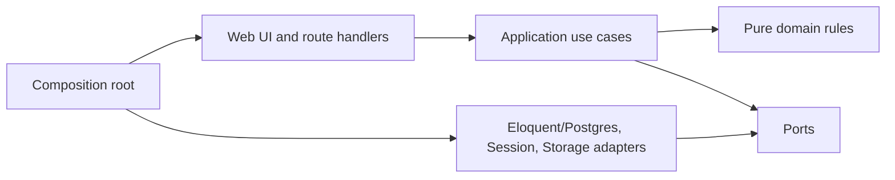
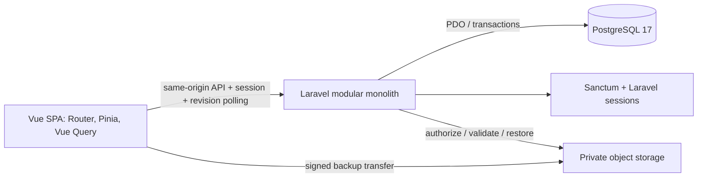
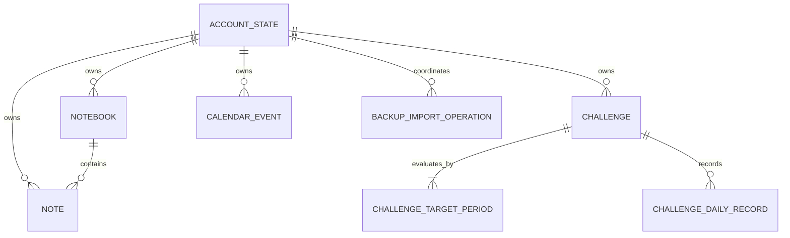

# Architecture Spine — NoteFlow MVP v1

PRD v1.1 is authoritative when the brief or UX differs. On 2026-09-13 the owner approved the Vue/Laravel architecture direction. AD-1, AD-5, AD-8, AD-15 and the deployment topology in AD-12 are adopted. On 2026-09-19 the owner additionally adopted AD-6 for product mutations, explicitly including Challenge create/update and the revision semantics recorded below. D-01–D-10 in the companion proposal were subsequently adopted as the approved planning baseline used to decompose Epics and Stories; that later handoff state is recorded in `docs/product/epics.md` and builds on the current Vue/Laravel resolution. The retained `[PROPOSED]` labels and Deferred table preserve the earlier authoring structure and do not reopen a D-01–D-10 decision adopted for planning. Only operational values or verification conditions that the adopted baseline itself leaves unspecified remain deferred, including provider/budget and production runtime capacity, session duration, the concrete device/browser acceptance matrix, measured search/sync thresholds, final tuned autosave cadence, and final limits derived from backup-size testing.

## Design Paradigm

Use a **modular monolith with ports-and-adapters**. Vue calls Laravel JSON controllers, which call PHP application use cases. Application use cases own transactions and invoke pure domain rules. Domain code has no framework, network, or database dependency. Adapters implement persistence, session authentication, clock and backup transfer ports.



## Invariants & Rules

### AD-1 — One deployable modular monolith [ADOPTED]

- **Binds:** EPIC-001–EPIC-006
- **Prevents:** Feature teams creating independent services, duplicate data ownership, or distributed transactions for a one-account MVP.
- **Rule:** Ship Vue 3 SPA and Laravel JSON API in one repository and coordinated release, behind one HTTPS origin, with one PostgreSQL database. Vue Router owns SPA navigation. Organize Laravel by product module; do not introduce microservices, Inertia, SSR or separate search/calendar services into the approved baseline.

### AD-2 — Server-authoritative account clock [PROPOSED]

- **Binds:** FR-006–023, FR-031–038, FR-042; NFR-003, NFR-010
- **Prevents:** Devices assigning different account dates, week boundaries, streaks, or event-day membership.
- **Rule:** Each use case captures one instant and derives one immutable AccountTimeContext using PHP `DateTimeImmutable`/`DateTimeZone` and the timezone stored in account_state. All participating modules use that context for canonical today, Monday–Sunday week keys, valid completion dates, goal effective dates, and event day intervals. Event form values are interpreted in the account timezone on the server. Device timezone and independent CURRENT_DATE calls are not authoritative; displayed product dates/times use the account timezone.

### AD-3 — Facts are authoritative; streaks are projections [PROPOSED]

- **Binds:** EPIC-002, EPIC-003, EPIC-005, EPIC-006
- **Prevents:** Stored progress, calendar icons, and streak counters drifting after backfill, undo, archive, goal changes, conflicts, or restore.
- **Rule:** Persist challenge identity, start/archive dates, target timeline, and daily records. Derive weekly progress, weekly/day streaks, records, archived streak, and calendar Done views from those facts through one domain engine. Any cache is disposable and rebuildable.

### AD-4 — Modules own data and mutations [PROPOSED]

- **Binds:** all
- **Prevents:** Today, Calendar, Search, or Backup becoming a second writer of another module's state.
- **Rule:** `challenges` owns challenges, targets, daily records, and challenge calculations; `notes` owns notebooks, notes, and note search; `calendar` owns events; `identity` owns account context; `backup` orchestrates versioned snapshots. `today` is a read composer. Cross-module writes call the owning application use case.
- **Read boundary:** Persistence is private to its module. Other modules use typed query ports/DTOs with explicit units, dates and versions. Calendar consumes explicit `isDone`, never daily-row existence. Today and Calendar compose through a shared read snapshot and AccountTimeContext. Backup uses module snapshot/restore ports with one shared transaction rather than normal per-item commands.

### AD-5 — Authenticated API is the only product write boundary [ADOPTED]

- **Binds:** FR-001–046; NFR-004–008
- **Prevents:** Browser code bypassing domain validation, authorization, restore locks, or concurrency checks through direct table access.
- **Rule:** All product reads/writes use Laravel API application services, protected by Sanctum's stateful SPA session authentication and owner authorization. Initialize CSRF via /sanctum/csrf-cookie; send the X-XSRF-TOKEN header on unsafe requests. The session cookie is Secure/HttpOnly; the XSRF token cookie must be readable by the client. Regenerate the session on login, invalidate it on logout. Users/password hashes and sessions are operational identity data outside product backup. Never expose database credentials or require bearer tokens in browser storage.
- **Admission/privacy:** Only the pre-provisioned owner subject is admitted; signup and anonymous sign-in are disabled. Private API responses use no-store and cannot enter a shared response cache. Unsafe cookie-authenticated requests enforce same-origin/CSRF checks. User content and snippets render as text. Direct backup-byte transfer is the narrow AD-12 exception; only the API authorizes handles and live-data replacement.

### AD-6 — Versioned, idempotent mutations [ADOPTED]

- **Binds:** FR-002–005, FR-007–009, FR-012, FR-023, FR-029, FR-043; NFR-003–006
- **Prevents:** Duplicate creates/Done records, last-write-wins data loss, stale device writes, and late acknowledgements marking newer text as saved.
- **Rule:** Client-generated UUID/idempotency key identifies each command; mutable resources carry a monotonically increasing row version; every mutation carries base version and account data epoch. Same-result Done/undo converges; stale opposite Done/undo or stale text returns a typed conflict and does not mutate saved state.
- **Enforcement:** Every product write first locks the account_state row FOR UPDATE and checks owner, open write_state and data_epoch while holding it through commit. Resource identity differs from command identity. A command ledger keyed by owner/epoch/command ID stores request hash and replayable acknowledgement atomically with the mutation; replay cannot mutate twice, and a different payload with the same key is rejected. Successful command identities remain available for the lifetime of that epoch. Create has no prior row version; a previously absent daily component uses version 0. Only a transaction that actually changes persisted product state increments `account_revision`, exactly once; replaying the same command or accepting a no-op does not increment it again.
- **Daily components:** Completion and journal have separate logical version tokens. Completion writes only is_done and its version; journal writes only journal and its version. Same-result completion succeeds; stale opposing completion conflicts only against completion changes. Undo never deletes journal. Text and aggregate conflict scope follows the D-05 matrix adopted in the planning baseline.

### AD-7 — Per-note in-session draft state machine [PROPOSED]

- **Binds:** FR-003–005, FR-029; AX-02–04
- **Prevents:** Switching notes losing text, a late save response changing the wrong editor, false “Saved” state, or an accidental offline product promise.
- **Rule:** Keep draft, client revision, acknowledged server version, request state, and error/conflict per note ID in browser memory. Debounced save and navigation flush do not block switching. Only an acknowledgement for the latest client revision may mark that note saved. Never persist a retry queue across reload as part of MVP.
- **Ordering:** At most one content save per note is in flight. Coalesce later edits; after ACK, advance the base version and send the latest dirty revision. Unknown outcomes retry the identical command ID/payload before any newer save. Different notes may save concurrently. Query refetch never replaces a dirty draft.
- **Quick-note contract (AX-05):** Opening a new blank editor allocates a client ID but does not persist an empty note before input. Title may be empty; an existing note is never deleted just because its text becomes empty. Label = explicit title, else first nonblank body line, else “Không tiêu đề”; derived labels never write back into title. Laravel validation and Vue display use these same rules, preserving entered text.

### AD-8 — Revision polling and refetch [ADOPTED]

- **Binds:** FR-002–004, FR-023, FR-046; AX-07, AX-09
- **Prevents:** Stale server caches, out-of-order responses overwriting drafts, or silent sync failures between two devices.
- **Rule:** TanStack Vue Query polls authenticated GET /api/v1/account for account_revision, data_epoch and write_state while visible/online; also fetch on login, focus and reconnect. Each state-changing transaction increments account_revision once. A higher revision invalidates all owner query caches; a changed epoch stops old draft retries and clears server state. Refetch never replaces dirty Pinia drafts. No WebSocket service or queue worker is required for MVP synchronization.
- **Convergence:** Use a single non-overlapping polling loop, initially 5 seconds, with bounded retry backoff and explicit sync-error state. Stop on logout/401; pause when hidden/offline and reconcile before resuming edits. Track the latest response generation so late responses cannot regress epoch/revision. Mutation ACK also invalidates affected local queries. Refetch time-based views at the server-reported next-day boundary. Polling interval is not a promised visibility SLA; D-09 remains open.
- **Restore observation:** A non-open write_state disables product mutations and pauses draft saves immediately. Return the active import operation ID with account state; query its status and reconcile epoch before enabling writes again. Server locking still enforces the fence during the interval before another device's next poll.

### AD-9 — Atomic backup restore with a dataset epoch [PROPOSED]

- **Binds:** FR-040–046; NFR-006, NFR-008; AX-08
- **Prevents:** Partial replacement, concurrent stale writes during import, duplicate import after an unknown response, or old drafts overwriting restored data.
- **Rule:** Validate the versioned snapshot before confirmation. After confirmation, create a durable import operation, acquire an account-wide write fence, revalidate the payload fingerprint, and replace all product facts in one PostgreSQL transaction. Known failure rolls back to the prior dataset. Success increments `data_epoch`; every client with an old epoch must discard server cache, stop draft retries, and refetch before writing. Operation status is queryable by ID after reconnect.
- **Atomic gate:** Start restore under the same account-row lock as AD-6, waiting for admitted writes to finish, then durably bind the fence to one operation. Replacement holds that lock; facts, new epoch/revision, succeeded status and reopening commit together. Failure recovery locks the same row before marking failed/reopening. An expired execution lease alone never unlocks: status reconciliation must acquire the lock, re-read the operation and prove no replacement transaction can still commit. A delayed executor rechecks its lease and status under that lock and stops if no longer valid.
- **Snapshot:** Export all module fragments in one read-only REPEATABLE READ transaction with one time context and validate the assembled manifest before offering download. Snapshot authority includes only FR-040 facts; credentials, drafts, locks, command ledger and operation rows are excluded. Restore never installs the file's operational epoch or lock. All restore ports share the replacement transaction and constraints remain enabled.

### AD-10 — Database-native saved-note search [PROPOSED]

- **Binds:** FR-030; NFR-009; AX-06
- **Prevents:** Search scope expanding into journals/events, accent handling differing across clients, or an external search index becoming inconsistently synchronized.
- **Rule:** Index only persisted note title/body in PostgreSQL using a canonical lower-case, accent-insensitive Vietnamese normalization and a `simple` full-text `tsvector` with GIN. Search returns note ID, notebook identity, label, snippet, and saved version. Query sequence/cancellation prevents stale responses from replacing current results.
- **Shared routine:** Index and query call the same versioned database normalization routine (Unicode NFC, fixed lower-case behavior, unaccent including đ/Đ). Changing it requires rebuilding the index. Snippets come from the saved version and are plain text. Whole-token versus prefix/substring and multi-word matching remain D-06 proposals.

### AD-11 — Explicit temporal storage types [PROPOSED]

- **Binds:** FR-006–023, FR-031–038, FR-042
- **Prevents:** UTC timestamps being confused with account calendar dates or inclusive/exclusive event boundaries differing by module.
- **Rule:** Store challenge completion, start/archive, and goal-effective values as account-local `date`; store audit times and event instants as UTC `timestamptz`; store timezone as an IANA identifier. Treat event ranges as half-open `[start, end)` and convert each selected account-local day to a UTC interval on the server.

### AD-12 — Same-origin single-region MVP deployment [ADOPTED]

- **Binds:** EPIC-001–EPIC-006; NFR-004–009
- **Prevents:** Cross-origin session complexity, fragmented releases and partial backups caused by untested runtime limits.
- **Rule:** Deploy a static Vue build and Laravel/PHP-FPM behind Nginx or equivalent on one HTTPS origin, with managed PostgreSQL nearby. /api, /sanctum and login/logout route to Laravel; only UI routes use SPA history fallback. Serve no Laravel source, .env or private files. Keep staging and production databases/secrets/buckets separate. Provider and budget remain D-04 decisions; Node is a build tool, not a production application server.
- **Runtime/transfer:** Size PHP-FPM concurrency and PDO PostgreSQL connections against the database limit; migrations use a separate role. Private object storage uses API-authorized short-lived signed handles bound to owner/operation/random key/method, with CORS allowing only the app origin for direct transfer and no bucket listing. Revalidate size/hash and enforce parser limits. Configure PHP/proxy/database timeouts with the execution lease and verify the maximum accepted backup fixture. Cleanup temporary objects on completion or within a proposed 24-hour retention via a scheduler. Operational limits must never cause partial export/restore.

### AD-13 — Relational invariants and target timeline [PROPOSED]

- **Binds:** FR-007–032, FR-040–046; NFR-003, NFR-008
- **Prevents:** Races or restore introducing duplicate Done/default notebooks, broken ownership, or ambiguous historical targets.
- **Rule:** Enforce owner-compatible foreign keys, note notebook membership with delete restriction, unique challenge/date, target range 1–7, unique challenge/effective-date, archive/start bounds and end > start in PostgreSQL. Provision/restore exactly one protected default notebook transactionally. Initial target is effective on start_date; subsequent periods use greatest effective_from ≤ evaluated date. Under the account write lock, allow at most one future period, always next Monday; archive removes pending periods. Do not persist a second authoritative current target or effective_to. Restore uses the same constraints and domain validation.

### AD-14 — Client navigation and private cache lifecycle [PROPOSED]

- **Binds:** AX-01–04, AX-09; NFR-001–002, NFR-007
- **Prevents:** Responsive navigation remounting drafts, note selection races, or old private state surviving account/epoch changes.
- **Rule:** Keep the draft store above responsive route layouts. Selection keys are IDs; the latest navigation request wins and the editor cannot show old content under a new note identity. Deep links take precedence over device-local navigation preferences; validate restored IDs and never restore destructive dialogs. Only non-content navigation/sidebar preferences persist locally. Clear private query state on logout; on restore stop old drafts and refetch before editing. Preserve focus/selection when saved timestamps reorder lists.
- **Session/epoch lifecycle:** All private requests and save callbacks capture the current authentication generation and data epoch; discard results from a different generation/epoch. After the unsaved-draft guard, explicit logout stops timers/requests, increments generation and clears both Pinia drafts and query caches. Session expiry locks private UI and stops retries; retain drafts only in memory, invisible until the same owner reauthenticates and epoch/version reconciliation completes. Successful restore quarantines old drafts with retries disabled; never apply a late pre-restore ACK or automatically replay an old draft.

### AD-15 — PHP/TypeScript API contract ownership [ADOPTED]

- **Binds:** EPIC-001–EPIC-006
- **Prevents:** PHP serialization, frontend types and validation evolving into incompatible contracts.
- **Rule:** Laravel owns runtime validation, domain rules and JSON serialization. The versioned OpenAPI contract in `contracts/` owns wire shapes; generate frontend TypeScript types from it and test Laravel request/response behavior against it in CI. PHP models are not browser DTOs. Backup has a separate versioned JSON schema validated server-side. Contract changes and generated frontend types ship in the same release; shared TypeScript runtime schemas across FE/BE are not assumed.

## Consistency Conventions

| Concern | Convention |
| --- | --- |
| Identifiers | UUID generated by the initiating client for create idempotency; never use display names as identity. |
| Dates | ISO `YYYY-MM-DD` for account-local dates; RFC 3339 UTC strings for instants; IANA name for timezone. |
| Versions | `row_version` is an integer incremented once per successful state change; `data_epoch` changes only after successful full restore. |
| API errors | `application/problem+json` with stable machine code, human message, resource identity, and conflict snapshot where applicable. |
| Mutations | Explicit desired state; no toggle APIs. Base version, data epoch, and idempotency identity are mandatory. |
| Deletion | Product deletes are hard deletes where PRD says no trash. Stale updates return not-found/conflict and never recreate the resource. |
| Logging | Structured request/operation IDs and error codes; never log note body, journal, event description, auth token, or backup payload. |
| Configuration | Provider URLs, secrets, timing and environment identity use validated configuration. Timezone is initialized once from the approved value, then read from account_state and included in product backup. |

## Stack

Architecture selects release lines, not an installed lockfile. Use the official create-vue Vite/TypeScript SPA scaffold plus a Laravel API project; no Inertia starter or generated public registration flow. Pin compatible patches in composer.lock and the frontend lockfile when implementation is requested. Official sources are linked in the companion proposal.

| Name | Version |
| --- | --- |
| Node.js (frontend build only) | 24 LTS, >=24.12 |
| TypeScript | 6.0 |
| Vue | 3.x |
| Vue Router | 5.x |
| Pinia | 4.x |
| Vite | 8.x |
| Laravel / Eloquent | 13.x |
| PHP | 8.4 |
| Laravel Sanctum | 4.x |
| Tailwind CSS | 4.3 |
| TanStack Vue Query | 5.x |
| PostgreSQL | 17, provider-managed minor |
| Pest / PHPUnit | 5.x / 13.x |
| Vitest | 5.0 |
| Playwright | 1.63 |

## Structural Seed





```text
backend/                  # Laravel project
  app/Http/               # controllers, requests, middleware
  app/Modules/            # Identity, Challenges, Notes, Calendar, Today, Backup
                          # each has Domain, Application, Infrastructure
  app/Providers/          # composition / dependency bindings
  routes/                 # API, auth routes
  database/migrations/    # constraints, extensions, identity and product tables
  tests/                  # PHP domain / real PostgreSQL integration
frontend/                 # create-vue SPA
  src/router/             # Vue Router
  src/stores/             # Pinia in-session drafts
  src/api/                # contract-generated types, HTTP client, Vue Query
  src/modules/            # product views/components
  tests/                  # Vitest component/draft tests
contracts/                # OpenAPI and versioned backup schema
tests/e2e/                # Playwright two-context journeys
deploy/                   # same-origin routing and runtime configuration
```

## Capability → Architecture Map

| Capability / Area | Lives in | Governed by |
| --- | --- | --- |
| EPIC-001 — access, sync, conflicts | `identity`, API boundary, client server-state | AD-2, AD-5, AD-6, AD-8, AD-9 |
| EPIC-002 — daily challenges | `challenges` commands and daily aggregate | AD-2, AD-3, AD-4, AD-6 |
| EPIC-003 — progress and streak | pure `challenges` domain engine | AD-2, AD-3, AD-11 |
| EPIC-004 — notes | `notes`, client drafts, Postgres search adapter | AD-4, AD-6, AD-7, AD-10 |
| EPIC-005 — calendar and Today | `calendar`; `today` read composer | AD-2, AD-3, AD-4, AD-11 |
| EPIC-006 — backup/restore | `backup`, account write fence, private storage | AD-5, AD-9, AD-12 |

## Deferred

| Decision | Why it remains open / revisit condition |
| --- | --- |
| Fixed IANA account timezone | DEP-002 requires Product Owner value before time-based acceptance. |
| Challenge start-date range and editability | DEP-001 requires Product Owner behavior before implementing FR-007–008 beyond today's default. |
| Login method and session duration | DEP-008 leaves the user experience and provider cost/security trade-off open. |
| Whole-note vs field-level conflict; edit vs delete | PRD §13.4 and UX §16 explicitly leave conflict scope unresolved. |
| Multi-word search matching | PRD §13.4 leaves AND/OR/phrase behavior unresolved. |
| Exact autosave delay and leave-screen behavior | PRD §13.4 and UX §16 require measurement/product review; 800 ms is only a proposal seed. |
| Device/browser acceptance matrix | DEP-005 requires the owner's real devices before browser/shortcut claims. |
| Search/sync acceptance thresholds | DEP-006 does not define percentile, network, or synchronization limit. |
| Field length and duplicate-name rules | UX §16 says these rules have no approved source; they affect validation and backup size. |
| Backup compatibility window and provider budget | FR-044 requires supported versions; DEP-007 leaves cost and release constraints open. |
